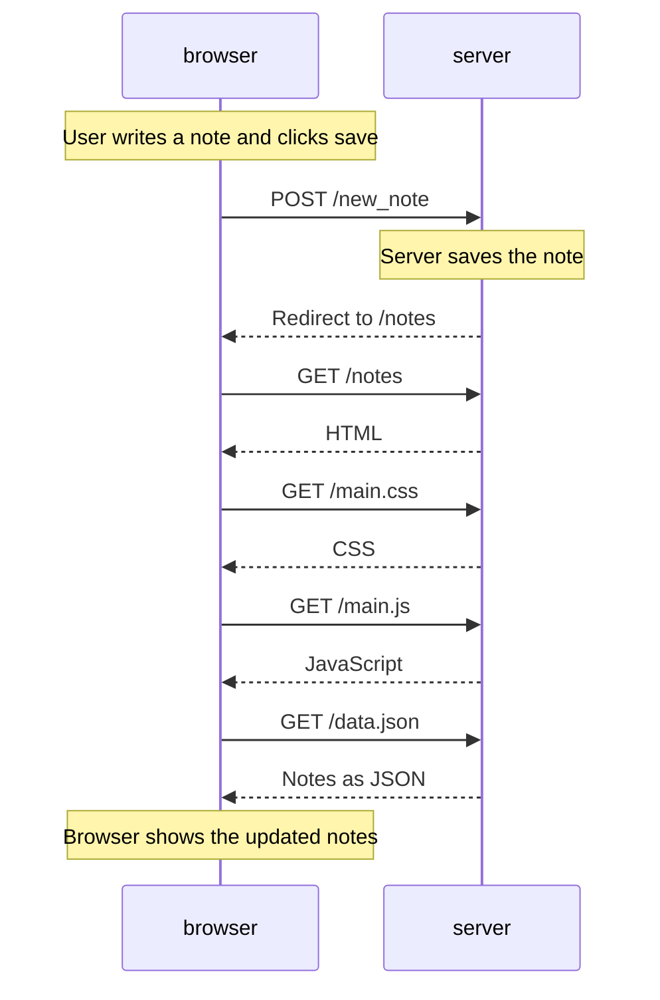

# Excersise 4

```mermaid
sequenceDiagram
    participant browser
    participant server

    Note over browser: User writes a note and clicks save
    browser->>server: POST /new_note
    Note over server: Server saves the note
    server-->>browser: Redirect to /notes
    browser->>server: GET /notes
    server-->>browser: HTML
    browser->>server: GET /main.css
    server-->>browser: CSS
    browser->>server: GET /main.js
    server-->>browser: JavaScript
    browser->>server: GET /data.json
    server-->>browser: Notes as JSON
    Note over browser: Browser shows the updated notes
```